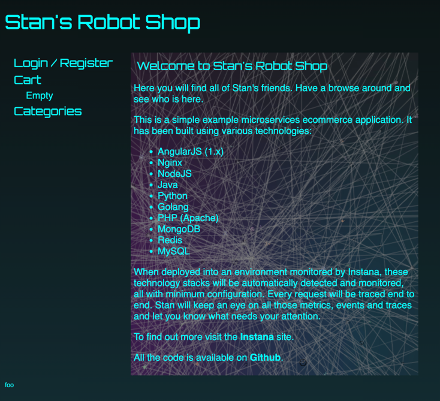

# Frontend Setup - RoboShop V1

This document details the Ansible automation for setting up the Frontend component of the RoboShop application.

##  Overview

* **Project:** Ansible-RoboShop-V1
* **Component:** Frontend (Nginx)
* **Target Host:** `frontend-dev.kiranpanchavati.online`
* **Playbook:** `frontend.yml`

##  Usage

To execute the frontend setup, run the following command from the control node:

```bash
ansible-playbook -i frontend-dev.kiranpanchavati.online, frontend.yml \
-e ansible_user=root \
-e ansible_password='<YOUR_PASSWORD>'
```

> **Note:** The comma (`,`) after the hostname in the `-i` flag is required to indicate a host list rather than a file path.

##  Playbook Tasks

The `frontend.yml` playbook performs the following configurations:

1.  **Gather Facts:** Collects system information (OS, Python version, IP, etc.).
2.  **Install Nginx:** Installs Nginx version 1.24.

##  Execution Log

*Date: December 14, 2025*

```log
[root@ansible-control-node Ansible-RoboShop-V1]# ansible-playbook -i frontend-dev.kiranpanchavati.online, frontend.yml \
-e ansible_user=root \
-e ansible_password='DevOps@123$%1S'

PLAY [Frontend Setup] **************************************************************************************************

TASK [Gathering Facts] *************************************************************************************************
[WARNING]: Host 'frontend-dev.kiranpanchavati.online' is using the discovered Python interpreter at '/usr/bin/python3.9', but future installation of another Python interpreter could cause a different interpreter to be discovered.
ok: [frontend-dev.kiranpanchavati.online]

TASK [Install Nginx 1.24] **********************************************************************************************
changed: [frontend-dev.kiranpanchavati.online]

PLAY RECAP *************************************************************************************************************
frontend-dev.kiranpanchavati.online : ok=2    changed=1    unreachable=0    failed=0    skipped=0    rescued=0    ignored=0
```

##  Status

* **Result:** Success (`ok=2`)
* **Changes Made:** Yes (`changed=1`) - Nginx was installed or updated.

### nginx-1.24.0 installed in frontend server 

```aiignore
[root@frontend-dev ~]# nginx -version
nginx version: nginx/1.24.0
```


## Extended Configuration

```aiignore

[root@ansible-control-node Ansible-RoboShop-V1]# ansible-playbook -i frontend-dev.kiranpanchavati.online, frontend.yml -e ansible_user=root -e ansible_password='DevOps@123$%1S'

PLAY [Frontend Setup] ***********************************************************************************************************************************************

TASK [Gathering Facts] **********************************************************************************************************************************************
[WARNING]: Host 'frontend-dev.kiranpanchavati.online' is using the discovered Python interpreter at '/usr/bin/python3.9', but future installation of another Python interpreter could cause a different interpreter to be discovered. See https://docs.ansible.com/ansible-core/2.20/reference_appendices/interpreter_discovery.html for more information.
ok: [frontend-dev.kiranpanchavati.online]

TASK [Install Nginx 1.24] *******************************************************************************************************************************************
ok: [frontend-dev.kiranpanchavati.online]

TASK [Install unzip] ************************************************************************************************************************************************
changed: [frontend-dev.kiranpanchavati.online]

TASK [Remove default html directory] ********************************************************************************************************************************
changed: [frontend-dev.kiranpanchavati.online]

TASK [create default html directory] ********************************************************************************************************************************
changed: [frontend-dev.kiranpanchavati.online]

TASK [Download and extract app content] *****************************************************************************************************************************
changed: [frontend-dev.kiranpanchavati.online]

TASK [Enable nginx service] *****************************************************************************************************************************************
changed: [frontend-dev.kiranpanchavati.online]

TASK [Restart nginx service] ****************************************************************************************************************************************
changed: [frontend-dev.kiranpanchavati.online]

PLAY RECAP **********************************************************************************************************************************************************
frontend-dev.kiranpanchavati.online : ok=8    changed=6    unreachable=0    failed=0    skipped=0    rescued=0    ignored=0

[root@ansible-control-node Ansible-RoboShop-V1]#
```


The playbook was further enhanced to complete the frontend setup with the following tasks:

1. Installed `unzip` package.
2. Removed the default Nginx HTML directory.
3. Recreated the HTML directory.
4. Downloaded and extracted RoboShop frontend application content.
5. Enabled Nginx service to start on boot.
6. Restarted Nginx service.

## Final Execution Status

```log
PLAY RECAP
frontend-dev.kiranpanchavati.online : ok=8    changed=6    unreachable=0    failed=0
```




## Frontend Setup – Final Execution Status

The Ansible playbook executed successfully and completed the full frontend setup.

- Nginx 1.24 is installed.
- `unzip` package is available.
- Default Nginx HTML directory was cleaned and recreated.
- RoboShop frontend application content was downloaded and extracted.
- Custom `nginx.conf` was copied to `/etc/nginx/nginx.conf`.
- Nginx service is enabled and restarted.

### Play Recap
- ok=9
- changed=5
- failed=0

**Frontend configuration completed successfully.**

```aiignore
[root@ansible-control-node Ansible-RoboShop-V1]# ansible-playbook -i frontend-dev.kiranpanchavati.online, frontend.yml -e ansible_user=root -e ansible_password='DevOps@123$%1S'

PLAY [Frontend Setup] ***********************************************************************************************************************************************

TASK [Gathering Facts] **********************************************************************************************************************************************
[WARNING]: Host 'frontend-dev.kiranpanchavati.online' is using the discovered Python interpreter at '/usr/bin/python3.9', but future installation of another Python interpreter could cause a different interpreter to be discovered. See https://docs.ansible.com/ansible-core/2.20/reference_appendices/interpreter_discovery.html for more information.
ok: [frontend-dev.kiranpanchavati.online]

TASK [Install Nginx 1.24] *******************************************************************************************************************************************
ok: [frontend-dev.kiranpanchavati.online]

TASK [Install unzip] ************************************************************************************************************************************************
ok: [frontend-dev.kiranpanchavati.online]

TASK [Remove default html directory] ********************************************************************************************************************************
changed: [frontend-dev.kiranpanchavati.online]

TASK [create default html directory] ********************************************************************************************************************************
changed: [frontend-dev.kiranpanchavati.online]

TASK [Download and extract app content] *****************************************************************************************************************************
changed: [frontend-dev.kiranpanchavati.online]

TASK [Copy nginx config file] ***************************************************************************************************************************************
changed: [frontend-dev.kiranpanchavati.online]

TASK [Enable nginx service] *****************************************************************************************************************************************
ok: [frontend-dev.kiranpanchavati.online]

TASK [Restart nginx service] ****************************************************************************************************************************************
changed: [frontend-dev.kiranpanchavati.online]

PLAY RECAP **********************************************************************************************************************************************************
frontend-dev.kiranpanchavati.online : ok=9    changed=5    unreachable=0    failed=0    skipped=0    rescued=0    ignored=0   

[root@ansible-control-node Ansible-RoboShop-V1]# 

```


## MongoDB Setup – Execution Result

The MongoDB Ansible playbook executed successfully on the target server.

### Tasks Performed
- MongoDB repository file was copied.
- MongoDB was installed.
- `mongod.conf` was updated to allow remote connections.
- MongoDB service was enabled and restarted.

### Command Used
```bash
ANSIBLE_HOST_KEY_CHECKING=False ansible-playbook -i mongod-dev.kiranpanchavati.online, mongodb.yml \
-e ansible_user=root \
-e ansible_password='DevOps@123$%1S'
````

### Execution Output

```log
PLAY [MongoDB Setup]

TASK [Gathering Facts]
ok: [mongod-dev.kiranpanchavati.online]

TASK [Copy the MongoDB Repo File]
changed: [mongod-dev.kiranpanchavati.online]

TASK [Install MongoDB]
changed: [mongod-dev.kiranpanchavati.online]

TASK [Replace old hostname with new hostname]
changed: [mongod-dev.kiranpanchavati.online]

TASK [Enable MongoDB service]
ok: [mongod-dev.kiranpanchavati.online]

TASK [Restart MongoDB service]
changed: [mongod-dev.kiranpanchavati.online]

PLAY RECAP
mongod-dev.kiranpanchavati.online : ok=6 changed=4 failed=0
```

**MongoDB setup completed successfully.**


## Catalogue Setup – Execution Result

The Catalogue Ansible playbook executed successfully on the target server.

### Command Used
```bash
ANSIBLE_HOST_KEY_CHECKING=False ansible-playbook -i catalogue-dev.kiranpanchavati.online, catalogue.yml \
-e ansible_user=root \
-e ansible_password='DevOps@123$%1S'
````

### Execution Output

```log
PLAY [Catalogue Setup]

TASK [Gathering Facts]
ok: [catalogue-dev.kiranpanchavati.online]

TASK [Install NodeJS 20]
ok: [catalogue-dev.kiranpanchavati.online]

TASK [Add the user 'roboshop']
ok: [catalogue-dev.kiranpanchavati.online]

TASK [Remove app directory]
changed: [catalogue-dev.kiranpanchavati.online]

TASK [create app directory]
changed: [catalogue-dev.kiranpanchavati.online]

TASK [Install unzip]
ok: [catalogue-dev.kiranpanchavati.online]

TASK [Download and extract app content]
changed: [catalogue-dev.kiranpanchavati.online]

TASK [Install packages based on package.json.]
changed: [catalogue-dev.kiranpanchavati.online]

TASK [Copy the MongoDB Repo File]
ok: [catalogue-dev.kiranpanchavati.online]

TASK [Install MongoDB shell (mongosh)]
ok: [catalogue-dev.kiranpanchavati.online]

TASK [Load Master Data]
changed: [catalogue-dev.kiranpanchavati.online]

TASK [Copy Catalogue Service file]
changed: [catalogue-dev.kiranpanchavati.online]

TASK [Start Catalogue service]
changed: [catalogue-dev.kiranpanchavati.online]

PLAY RECAP
catalogue-dev.kiranpanchavati.online : ok=13 changed=7 failed=0
```

### Status

* Catalogue service deployed successfully
* Application dependencies installed
* MongoDB master data loaded
* Service started without errors


